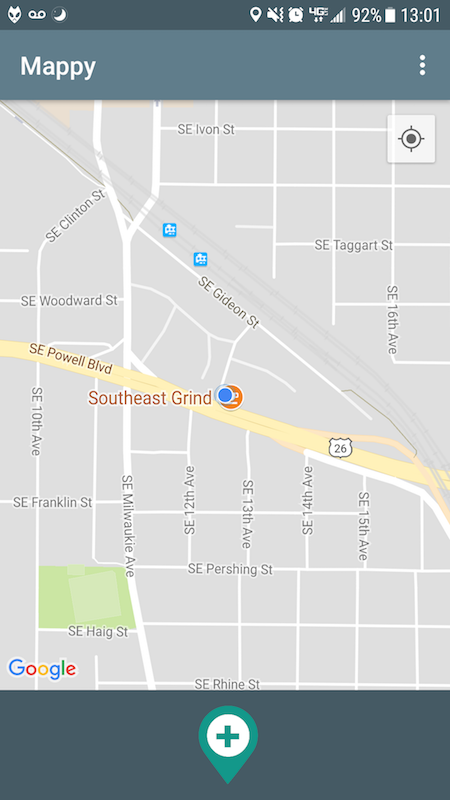
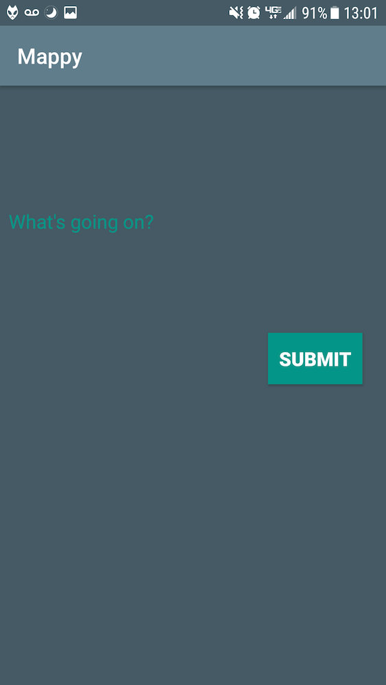
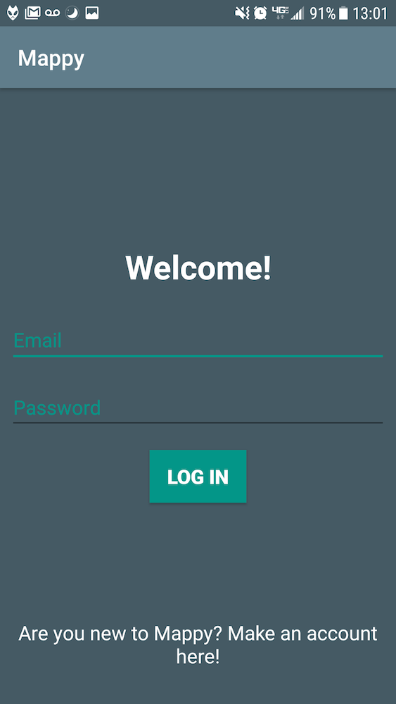
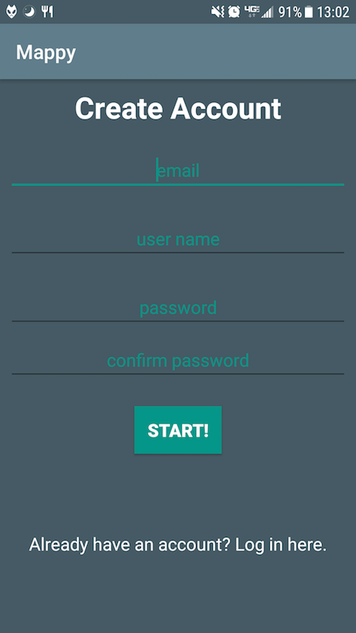

# Mappy

#### _A location-based social app_

Mappy is an app that lets you know what's going on wherever you are. You'll able to get an idea of what's going on in your town from just a quick glance at a map of your location.

Leave a comment about something going on where you are - an awesome local show, a sale on your favorite product at the store, or a cool meetup or presentation you're attending, your comment will be represented by a pin at the location of the event.

:--------------------------------:|:-----------------------------------:
        |  
    | 
 
 ## Setup/Installation 
* Clone this repository
* Open the file in Android Studio
* Run on Android Studio emulator or your android 

## License
 
Copyright (c) 2017 **_Christian Martinez_**

MIT license